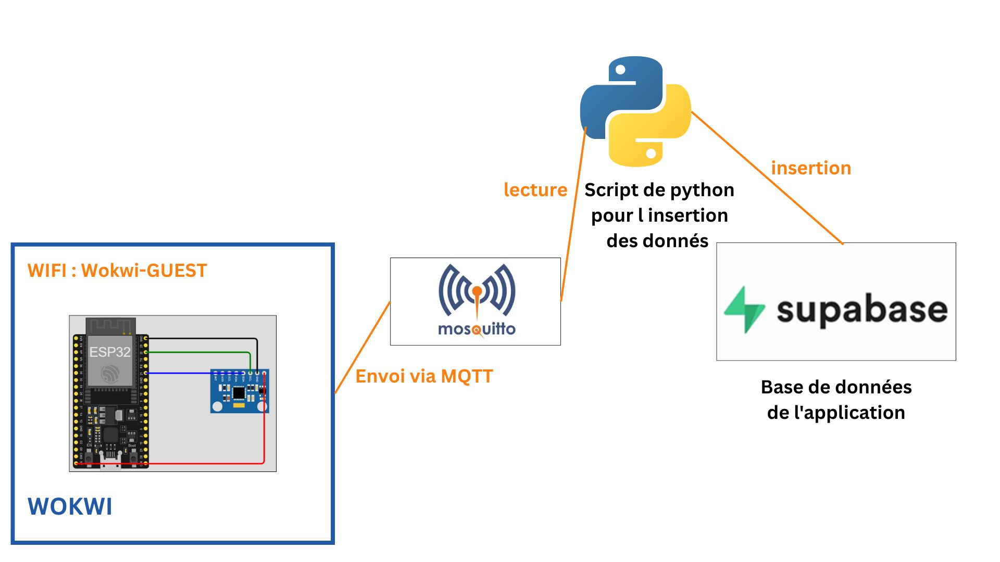

# XY-Axis-Vibration-Logger-with-Wokwi-and-Database-Sync Public
Real-Time Vibration Monitoring System on X and Y Axes Using Wokwi and Cloud Database Integration



## Project Overview
This project demonstrates a complete IoT data pipeline using:
- **Wokwi** for ESP32 simulation and prototyping 
- **ESP32** microcontroller for data collection
- **MPU6050** accelerometer for X/Y axis vibration measurement
- **MQTT protocol** for data transmission (via Mosquitto broker)
- **Mosquitto MQTT Broker** for secure data transmission
- **Python Bridge** for MQTT-to-Supabase integration
- **Supabase** for cloud data storage and visualization

## Important Note on Wokwi Implementation
Since Wokwi's simulation environment doesn't support HTTPS connections directly, this implementation uses:
1. **Mosquitto MQTT Broker** for secure data transmission from the ESP32
2. **Python Bridge Script** to receive MQTT messages and handle the HTTPS connection to Supabase

## Key Components

### 1. Hardware Layer
- **ESP33 Microcontroller**: Collects MPU6050 sensor data and transmits via WiFi and Published every **200ms** to `/wokwi/sensor_data`, this is an exemple of the message:
```json
{
  "data": {
    "load_value": 80,
    "speed_set": 25,
    "vibration_x": 12.34,
    "vibration_y": -7.89,
    "machine_id": 1,
    "is_active": 1
  }
}
```
- **Network**: Connects to `Wokwi-GUEST` WiFi network for development/testing

### 2. Data Transmission
- **Mosquitto MQTT Broker**: Secure message broker for IoT data transmission
- **Python Bridge Script**: Handles MQTT reception and HTTPS Supabase communication

### 3. Cloud Storage
- **Supabase**: Open-source Firebase alternative used as the application database

## Workflow
1. ESP32 collects MPU6050 sensor data  
2. Data is transmitted via MQTT to Mosquitto broker
3. Python script receives data from MQTT and forwards to Supabase via HTTPS
4. Processed data is stored in Supabase database

## Project Resources
- [Wokwi Simulation Project](https://wokwi.com/projects/433371236986210305)
- [Python Bridge Script](https://github.com/chaymaAitB/XY-Axis-Vibration-Logger-with-Wokwi-and-Database-Sync/blob/main/insert_to_server.py)

## Results


## License
This project is licensed under the MIT License - see the LICENSE file for details.
